# 📱 Proyecto de Aplicación Móvil - Asignación 1

**Integrantes del grupo:**

- Cabezas Diaz Renzo Edgar 20224558
- David Vela Larrea 20202209
- Diego Arturo Huaman Bonilla 20211287
- Rodrigo Alonso Lara Camacho 20211415
- Rodrigo Gabriel Pérez Peña 20191544

---

## 🛠️ Entorno de Desarrollo

El entorno de desarrollo de nuestra aplicación móvil para la administración de tareas está compuesto por una combinación de tecnologías orientadas al desarrollo multiplataforma, backend robusto y servicios en la nube. A continuación, detallamos cada una de las herramientas que estamos definiendo para utilizar, su propósito y cómo fueron configuradas para el proyecto.

### 1.Flutter

Descripción: Framework de código abierto desarrollado por Google, permite crear aplicaciones móviles nativas para Android e iOS a partir de un único código base.

Instalación:
Descargar el SDK desde flutter.dev.
Agregar Flutter al PATH del sistema.
Ejecutar flutter doctor para verificar dependencias y configuraciones necesarias.
Instalar un editor como Visual Studio Code o Android Studio, con el plugin de Flutter y Dart.

### 2. Ruby (Backend con Sinatra)

Descripción: Framework minimalista escrito en Ruby, ideal para desarrollar APIs RESTful de forma rápida y ligera.

Instalación:
Instalar Ruby (vía RVM o rbenv).
Instalar Sinatra mediante el comando gem install sinatra.
Crear el proyecto inicial con main.rb y config.ru para definir la API.
Configurar rutas para comunicar con la app Flutter.

### 3.Base de Datos PostgreSQL (Azure Database for PostgreSQL)

Descripción: Sistema de gestión de bases de datos relacional, utilizado para almacenar los datos estructurados de la aplicación como usuarios, tareas y categorías.

Instalación:
Crear una instancia en el portal de Azure.
Configurar firewall para permitir acceso desde el backend.
Usar el cliente psql o herramientas como PgAdmin para gestionar la base de datos.
Configurar las credenciales en el archivo database.yml del backend Ruby.

### 4.Azure Blob Storage

Descripción: Servicio de almacenamiento de objetos no estructurados en la nube, usado para guardar imágenes asociadas a las tareas o categorías.

Instalación:
Crear una cuenta de almacenamiento en Azure.
Crear un contenedor para las imágenes.
Generar SAS Tokens para acceso seguro desde el backend.
Integrar con el backend utilizando gemas como azure-storage-blob.

### 5.Servicio LLM (Large Language Model) Externo

Descripción: Modelo de lenguaje con IA usado para generar automáticamente listas de tareas personalizadas según las necesidades del usuario.

Integración:
Acceso vía API RESTful.
Configuración de autenticación con API Key o Bearer Token.
Uso de la biblioteca Net::HTTP o HTTParty en Ruby para enviar solicitudes al modelo.

### 6.Microsoft Azure (Plataforma de Despliegue)

Descripción: Plataforma cloud donde se alojan todos los servicios: backend, base de datos y almacenamiento.

Configuración:
Uso del Servicio de Aplicaciones de Azure para desplegar el backend Ruby.
Configuración de variables de entorno (por ejemplo, claves y URIs).
Uso de GitHub Actions para automatizar despliegues.

---

## 🚀 Diagrama de Despliegue

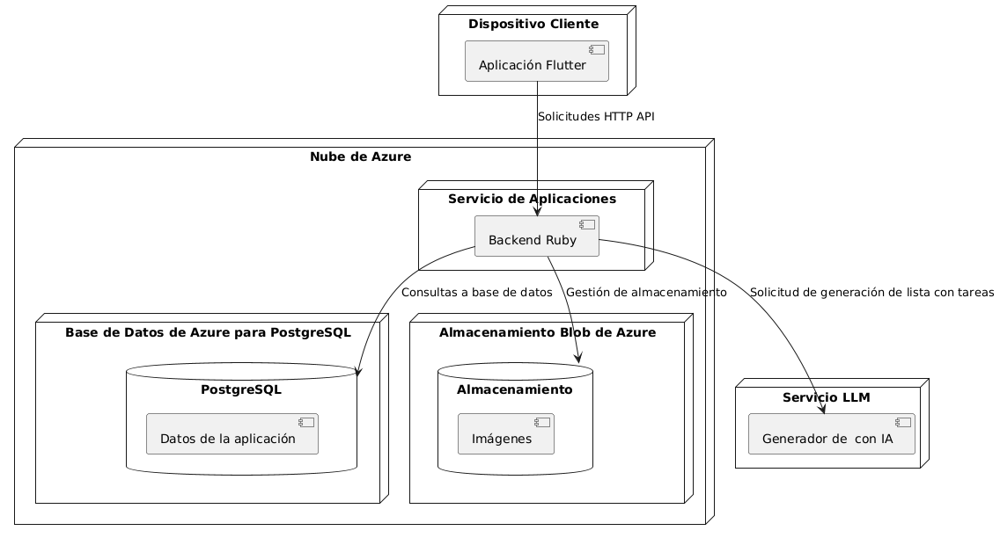

El diagrama de despliegue representa la arquitectura de una aplicación móvil desarrollada en Flutter que se comunica con un backend Ruby a través de solicitudes HTTP API. Este backend está desplegado en un Servicio de Aplicaciones dentro de la nube de Azure. La aplicación maneja datos estructurados mediante una base de datos PostgreSQL alojada en Azure Database for PostgreSQL, y archivos multimedia (como imágenes) a través de Azure Blob Storage. Además, el sistema integra un servicio LLM (modelo de lenguaje) externo, encargado de generar listas de tareas utilizando inteligencia artificial, al cual el backend envía solicitudes específicas. La arquitectura sigue un enfoque modular que separa claramente los componentes de cliente, lógica de negocio, almacenamiento, base de datos y generación inteligente.

---

## ☁️ Requisitos No Funcionales

### Autenticación segura entre cliente y servidor

La aplicación móvil en Flutter debe comunicarse con el backend mediante HTTPS cada solicitud enviada al servidor Ruby.

### Disponibilidad del backend

El Servicio de Aplicaciones de Azure que ejecuta el backend Ruby garantiza disponibilidad continua.

### Acceso rápido a imágenes

El acceso a imágenes almacenadas en Azure Blob Storage debe realizarse mediante URLs firmadas (SAS tokens).

### Tolerancia a fallos en la generación IA

Las solicitudes al servicio LLM deben manejar errores y tiempos de espera, permitiendo mostrar mensajes adecuados al usuario si el generador falla o demora.

### Eficiencia en consultas a la base de datos

Las consultas del backend Ruby hacia PostgreSQL deben estar optimizadas con índices y paginación para garantizar tiempos de respuesta bajos, incluso con grandes volúmenes de datos.

### Escalabilidad del sistema

Cada componente (backend, base de datos, almacenamiento y servicio IA) debe poder escalarse de forma independiente según la demanda de usuarios o procesamiento.

---

## ✅ Diagrama de Casos de Uso

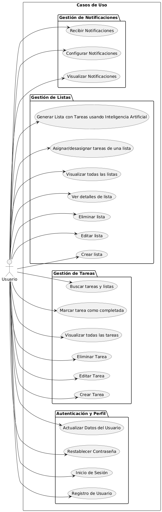

### Casos de Uso

| Caso de Uso                                 | Descripción |
|----------------------------------------------|-------------|
| Registro de Usuario                         | Permite al usuario registrarse en el sistema proporcionando sus datos personales. |
| Inicio de Sesión                            | Permite al usuario iniciar sesión en la aplicación. |
| Restablecer Contraseña                      | Permite al usuario recuperar el acceso a su cuenta mediante el restablecimiento de contraseña. |
| Actualizar Datos del Usuario                | Permite al usuario actualizar su información personal. |
| Crear Tarea                                 | Permite al usuario crear una nueva tarea. |
| Editar Tarea                                | Permite al usuario editar una tarea existente. |
| Eliminar Tarea                              | Permite al usuario eliminar una tarea existente. |
| Visualizar todas las tareas                 | Permite al usuario ver todas las tareas disponibles. |
| Marcar tarea como completada                | Permite al usuario marcar una tarea como completada. |
| Buscar tareas y listas                      | Permite al usuario buscar tareas y listas específicas. Ademas de poder usar buscar por categorias o etiquetas. |
| Crear lista                                 | Permite al usuario crear una nueva lista de tareas. |
| Editar lista                                | Permite al usuario editar el nombre, color o descripción de una lista. |
| Eliminar lista                              | Permite al usuario eliminar una lista existente. |
| Ver detalles de lista                       | Permite al usuario ver los detalles de una lista específica. |
| Visualizar todas las listas                 | Permite al usuario visualizar todas las listas creadas. |
| Asignar/desasignar tareas de una lista       | Permite al usuario asignar o desasignar tareas a/de una lista. |
| Generar Lista con Tareas usando IA           | Permite generar automáticamente una lista de tareas utilizando Inteligencia Artificial. |
| Visualizar Notificaciones                   | Permite al usuario visualizar sus notificaciones. |
| Configurar Notificaciones                   | Permite al usuario configurar cómo desea recibir notificaciones. |
| Recibir Notificaciones                      | Permite al usuario recibir notificaciones de eventos importantes. |

---

## 📸 Imágenes de Casos de Uso

### Autenticación y Perfil

#### Registro de Usuario

- **Actor:** Usuario no registrado

- **Objetivo:** Verificar los datos del usuario para permitir el registro

- **Pasos principales:**
  1. El usuario ingresa sus datos.

  2. El sistema valida los datos.

  3. Si son válidos, redirige a la pantalla principal.

  4. Si son inválidos, muestra un mensaje de error.

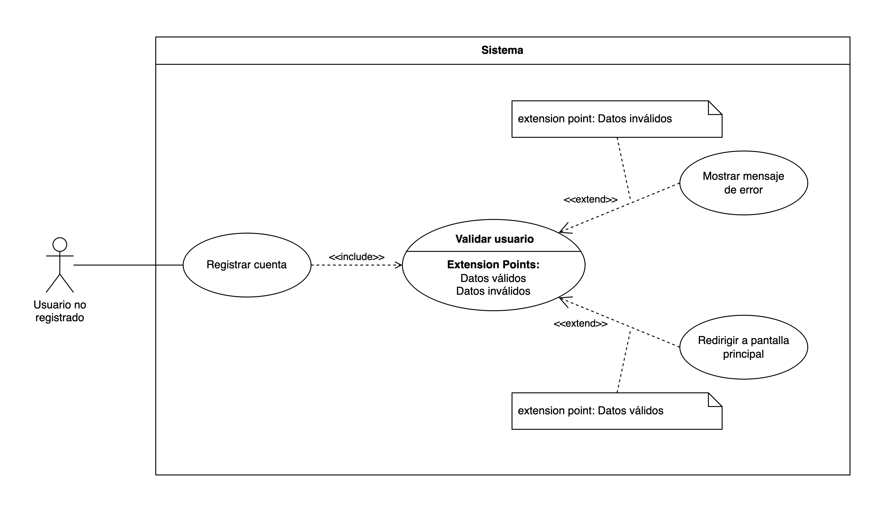  

&nbsp;

#### Inicio de Sesión

- **Actor:** Usuario

- **Objetivo:** Iniciar sesión en el sistema

- **Pasos principales:**
  1. El usuario ingresa sus credenciales.

  2. El sistema valida las credenciales.

  3. Si son válidas, redirige a la pantalla principal.

  4. Si el usuario no existe, muestra error "Usuario no encontrado".

  5. Si la contraseña es incorrecta, muestra error "Contraseña incorrecta".

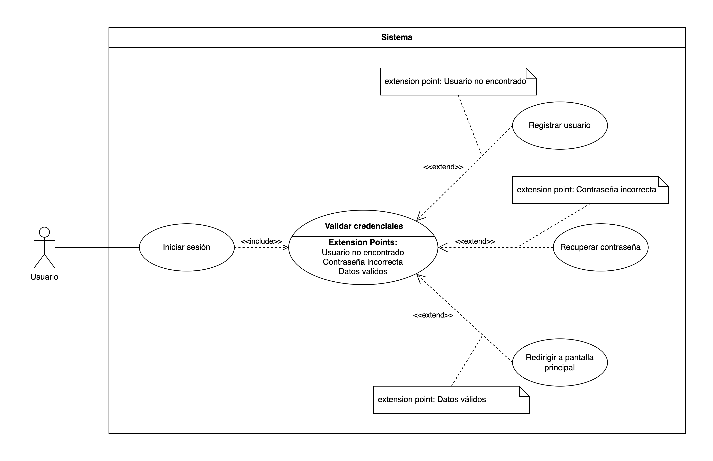  

&nbsp;

#### Restablecer Contraseña

- **Actor:** Usuario

- **Objetivo:** Restablecer contraseña

- **Pasos principales:**
  1. El usuario solicita restablecer contraseña.

  2. El sistema verifica si el usuario existe.

  3. Si el usuario existe:
      - Envía un correo con enlace de restablecimiento.
      - El usuario ingresa nueva contraseña.
      - El sistema actualiza la contraseña.

  4. Si el usuario no existe, muestra mensaje de error.

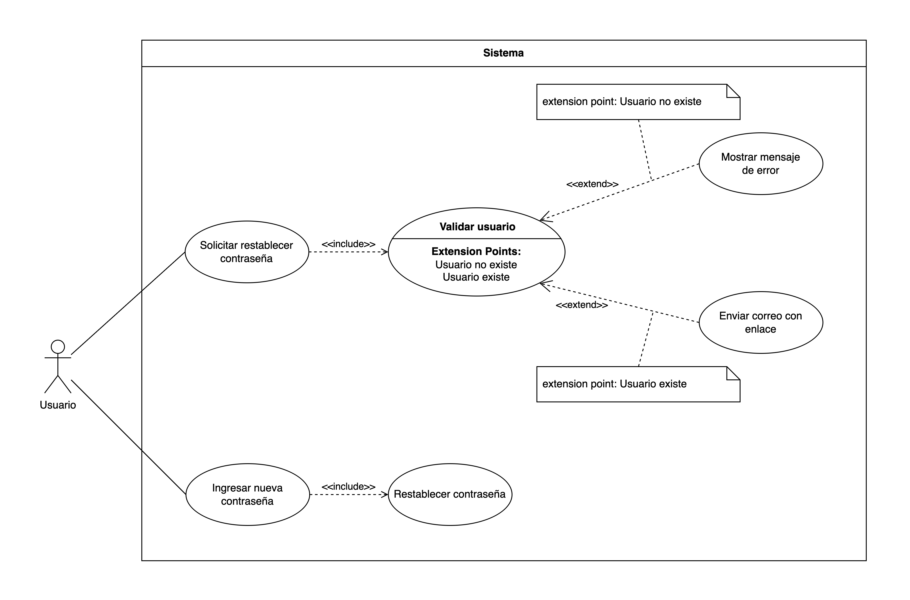  

&nbsp;

#### Actualizar Datos del Usuario

- **Actor:** Usuario

- **Objetivo:** Actualizar perfil

- **Pasos principales:**
  1. El usuario ingresa nuevos datos para actualizar su perfil.

  2. El sistema valida los datos.

  3. Si el email ya está en uso, muestra mensaje de error.

  4. Si los datos son válidos, actualiza el perfil y muestra un mensaje de éxito.

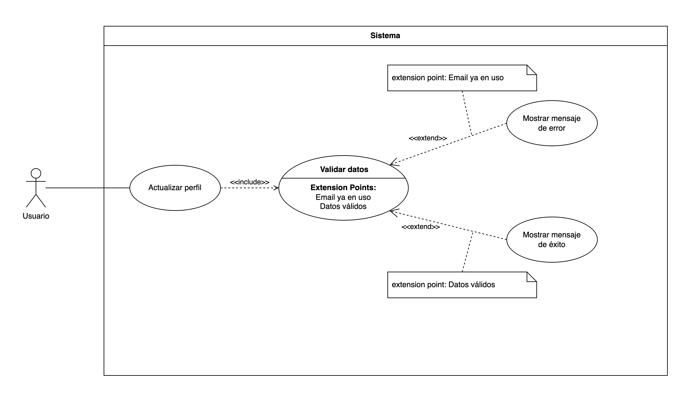  

&nbsp;

### Gestión de Tareas

#### Crear Tarea

- **Actor:** Usuario

- **Objetivo:** Crear una nueva tarea

- **Pasos principales:**
  1. El usuario ingresa los datos de la tarea.

  2. El sistema valida los datos.

  3. Si los datos están incompletos, muestra mensaje de error.

  4. Si hay error al guardar, muestra mensaje de error.

  5. Si los datos son válidos, guarda la tarea y muestra un mensaje de éxito.

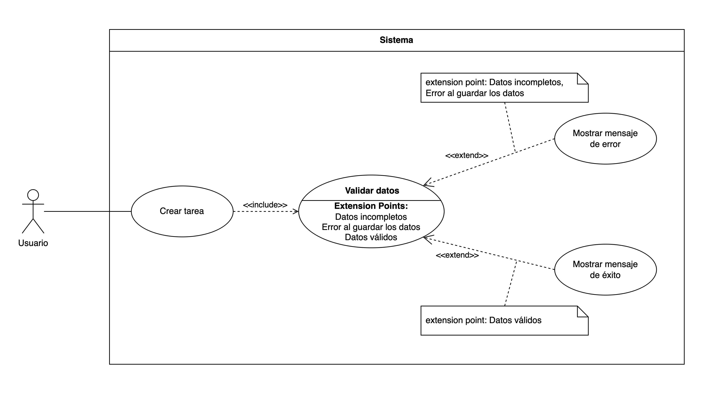  

&nbsp;

#### Editar Tarea

- **Actor:** Usuario

- **Objetivo:** Editar tarea existente

- **Pasos principales:**
  1. El usuario selecciona la tarea a editar.

  2. El sistema valida los datos modificados.

  3. Si los datos están incompletos o si la tarea no existe, muestra mensaje de error.

  4. Si los datos son válidos, actualiza la tarea y muestra mensaje de éxito.

 

&nbsp;

#### Eliminar Tarea

- **Actor:** Usuario

- **Objetivo:** Eliminar una tarea existente

- **Pasos principales:**
  1. El usuario selecciona la tarea a eliminar.

  2. El sistema solicita confirmación.

  3. Si se confirma, elimina la tarea y redirige a la lista de tareas.

  4. Si ocurre un error, muestra mensaje de error.

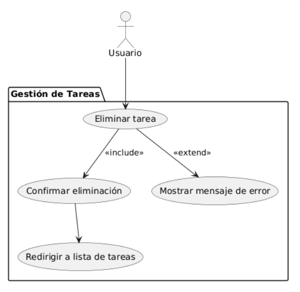

&nbsp;

#### Visualizar Tareas

- **Actor:** Usuario

- **Objetivo:** Visualizar todas las tareas

- **Pasos principales:**
  1. El usuario solicita ver la lista de tareas.

  2. El sistema carga las tareas desde la base de datos.

  3. El sistema muestra la lista de tareas al usuario.

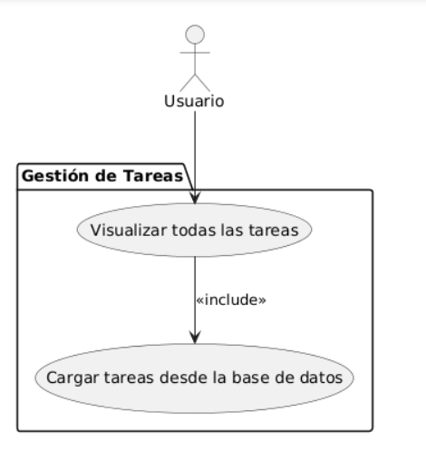  

&nbsp;

#### Marcar Tarea como Completada

- **Actor:** Usuario

- **Objetivo:** Marcar tarea como completada

- **Pasos principales:**
  1. El usuario selecciona la tarea a marcar como completada.

  2. El sistema actualiza el estado en la base de datos.

  3. El sistema muestra mensaje de confirmación al usuario.

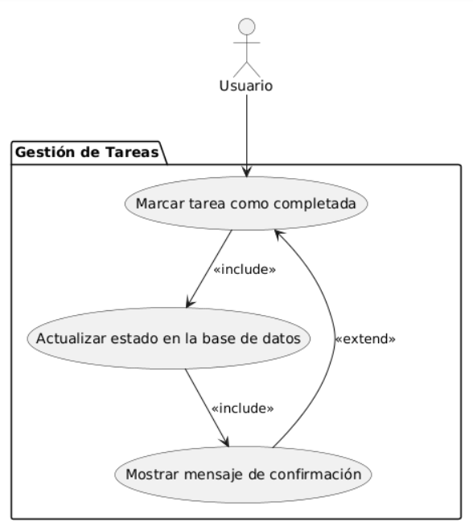  

&nbsp;

#### Buscar Tareas y Listas

- **Actor:** Usuario

- **Objetivo:** Buscar tareas y listas

- **Pasos principales:**
  1. El usuario ingresa el criterio de búsqueda.

  2. El sistema consulta la base de datos.

  3. El sistema muestra los resultados de la búsqueda al usuario.

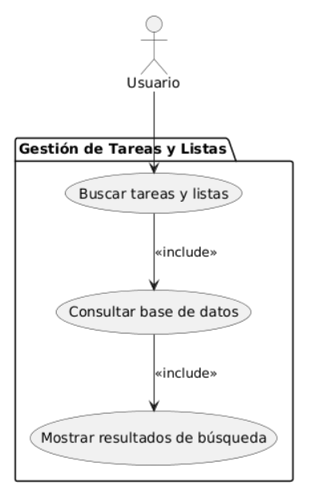  

&nbsp;

### Gestión de Listas

#### Crear Lista

- **Actor:** Usuario  

- **Objetivo:** Crear una nueva lista  

- **Pasos principales:**  
  1. El usuario ingresa los datos de la nueva lista.  

  2. El sistema guarda la lista en la base de datos.  

  3. El sistema muestra mensaje de confirmación.  

  4. El sistema regresa a la pantalla inicial.

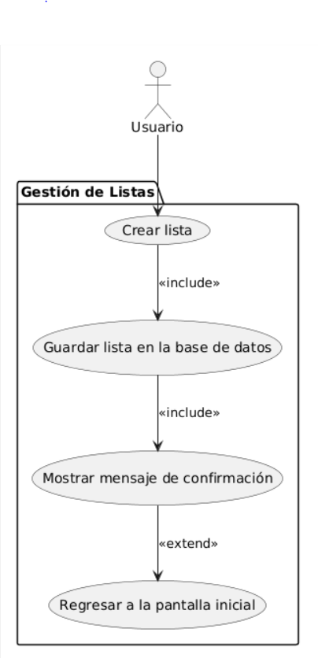  

&nbsp;

#### Editar Lista

- **Actor:** Usuario

- **Objetivo:** Editar una lista existente

- **Pasos principales:**
  1. El usuario selecciona la lista a editar.

  2. El sistema valida los datos modificados.

  3. Si son válidos, guarda los cambios en la base de datos, muestra mensaje de confirmación y regresa a la pantalla inicial.

  4. Si hay error, muestra mensaje de error.

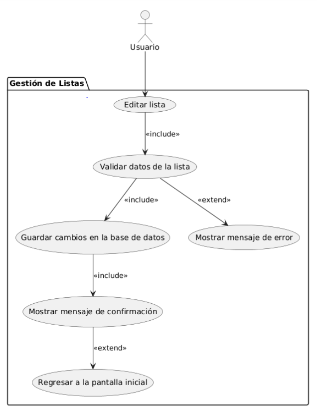  

&nbsp;

#### Eliminar Lista

- **Actor:** Usuario

- **Objetivo:** Eliminar una lista existente

- **Pasos principales:**
  1. El usuario selecciona la lista a eliminar.

  2. El sistema valida la eliminación.

  3. Elimina la lista de la base de datos, muestra mensaje de confirmación y regresa a la pantalla inicial.

  4. Si hay error, muestra mensaje de error.

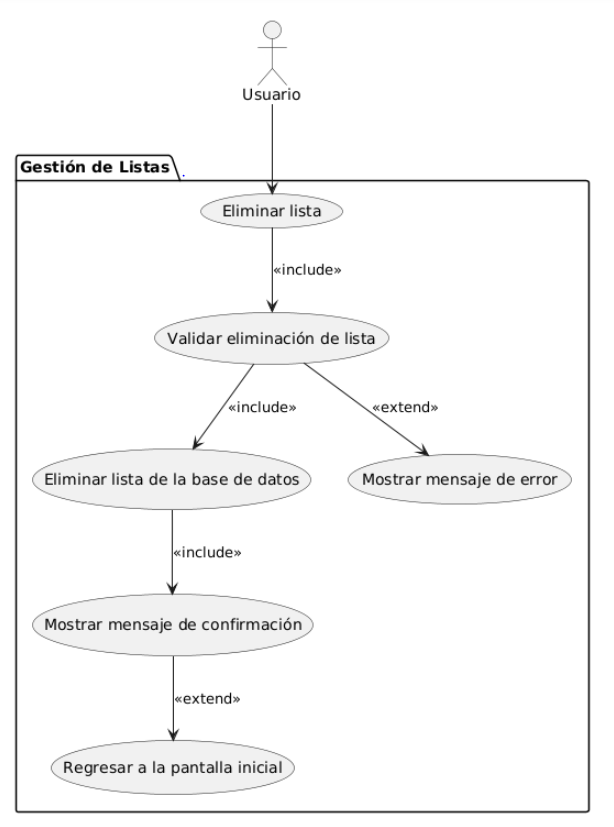  

&nbsp;

#### Ver Detalles de Lista

- **Actor:** Usuario

- **Objetivo:** Ver detalles de una lista

- **Pasos principales:**
  1. El usuario selecciona una lista.

  2. El sistema consulta la base de datos.

  3. El sistema muestra los detalles de la lista al usuario.

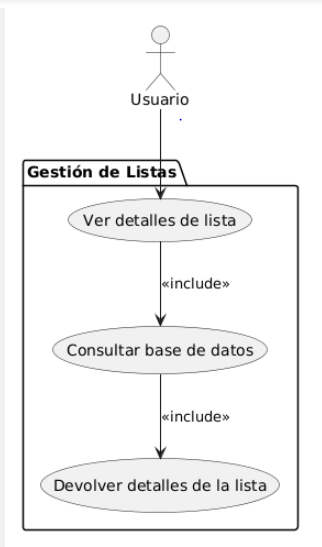

&nbsp;

#### Visualizar Todas las Listas

- **Actor:** Usuario

- **Objetivo:** Visualizar todas las listas

- **Pasos principales:**
  1. El usuario solicita ver las listas.

  2. El sistema consulta la base de datos.

  3. El sistema muestra todas las listas disponibles.

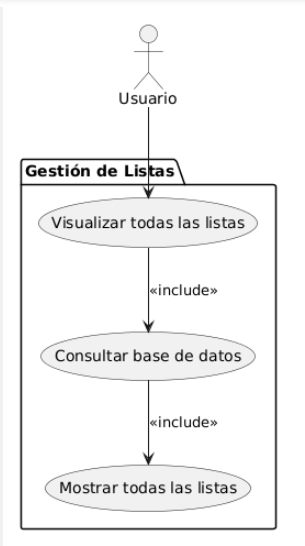  

&nbsp;

#### Asignar/Desasignar Tareas de una Lista

- **Actor:** Usuario

- **Objetivo:** Asignar/desasignar tareas de una lista

- **Pasos principales:**
  1. El usuario selecciona la tarea a asignar/desasignar.

  2. El sistema actualiza la base de datos.

  3. El sistema muestra mensaje de confirmación.

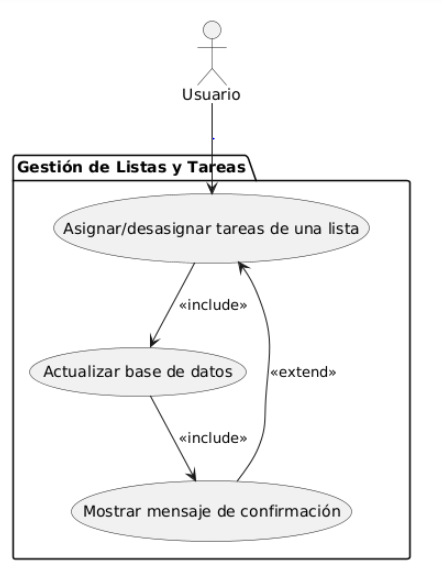  

&nbsp;

#### Generar Lista con Tareas usando Inteligencia Artificial

- **Actor:** Usuario

- **Objetivo:** Generar lista con IA

- **Pasos principales:**
  1. El usuario ingresa un prompt y solicita generar una lista con IA.

  2. El sistema valida los datos.

  3. Si hay error de conexión con el proveedor de LLM, muestra mensaje de error.

  4. Si la generación es exitosa, crea la lista con tareas.

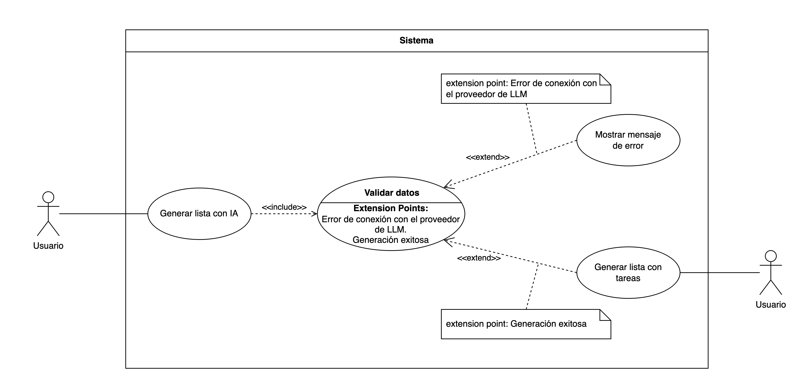  

&nbsp;

### Gestión de Notificaciones

#### Visualizar Notificaciones

- **Actor:** Usuario  

- **Objetivo:** Ver notificaciones  

- **Pasos principales:**  
  1. El usuario solicita ver notificaciones.  

  2. El sistema carga los datos.  

  3. Si hay error en la base de datos, muestra mensaje de error.  

  4. Si la lista está vacía, muestra mensaje indicando que no existen datos.  

  5. Si la carga es exitosa, muestra las notificaciones.

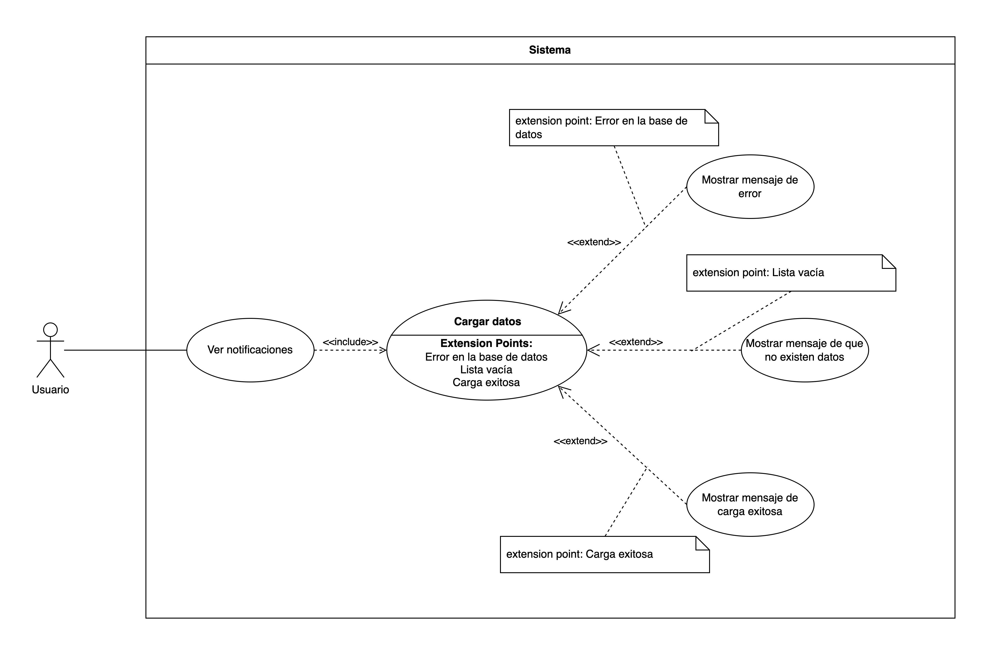  

&nbsp;

#### Configurar Notificaciones

- **Actor:** Usuario  

- **Objetivo:** Configurar notificaciones  

- **Pasos principales:**  
  1. El usuario establece sus preferencias de notificación.  

  2. El sistema guarda las preferencias.  

  3. Si hay error en la base de datos, muestra mensaje de error.  

  4. Si el guardado es exitoso, muestra mensaje de éxito.

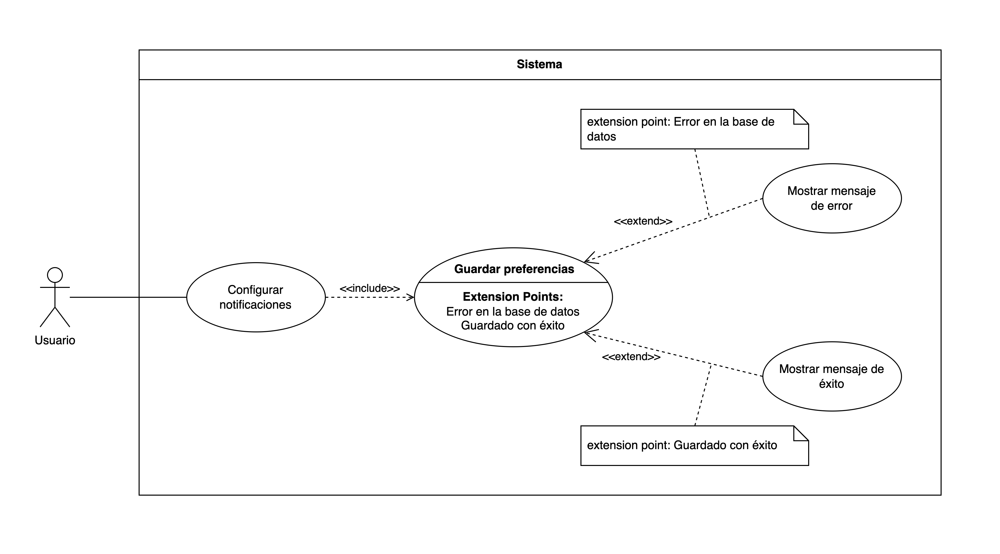  

&nbsp;

#### Recibir Notificaciones

- **Actor:** Sistema  

- **Objetivo:** Enviar notificaciones  

- **Pasos principales:**  
  1. El sistema intenta enviar notificaciones.  

  2. Si hay error en el envío, guarda log de error.  

  3. Si el envío es exitoso, registra el éxito.  

  4. Finaliza el proceso de notificación.

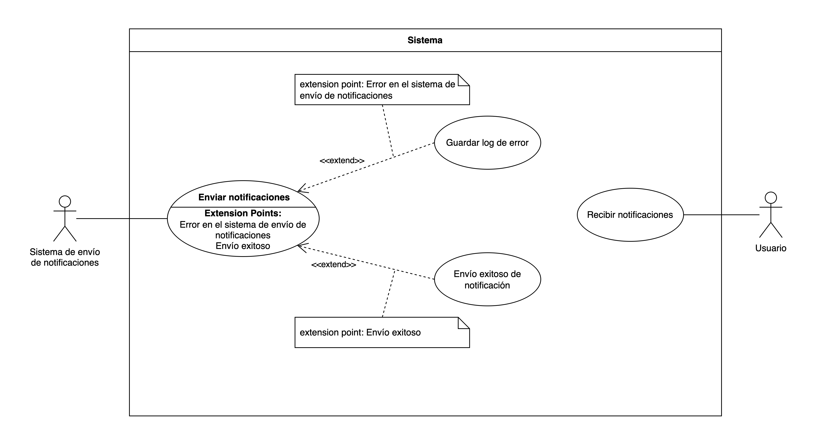  

---

## 📚 Diagrama de clases

  

---

## 📚 Descripción de Casos de Uso

### Autenticación y Perfil

La gestión de autenticación y perfil permite a los usuarios registrarse, iniciar sesión, restablecer su contraseña y actualizar sus datos personales. Estos procesos son fundamentales para garantizar la seguridad de la cuenta y la correcta gestión de la información del usuario.

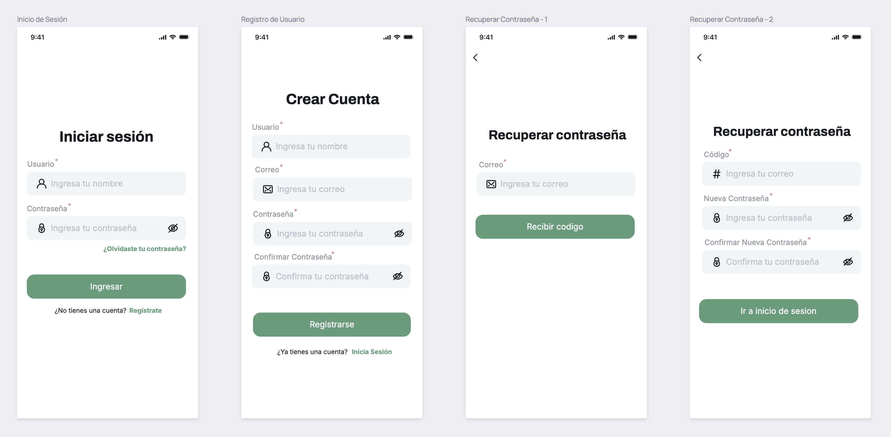

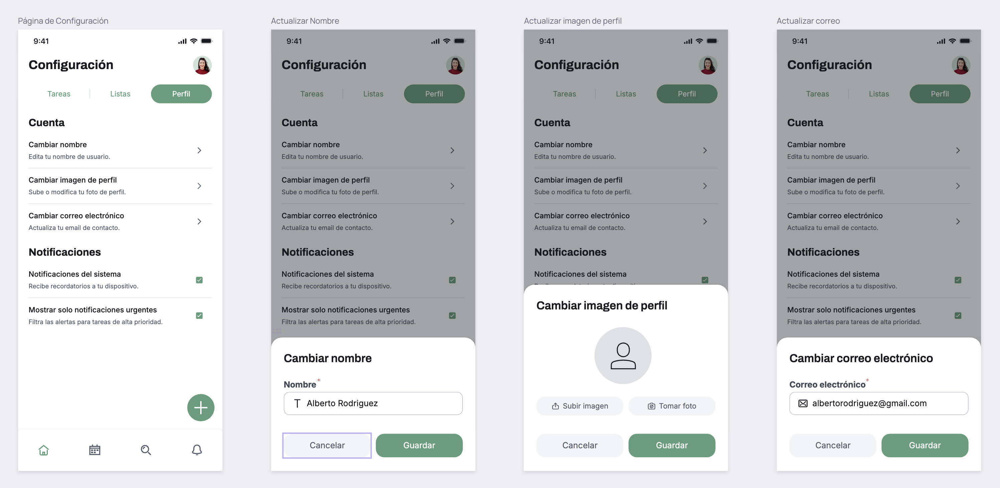

## Gestión de Tareas

La gestión de tareas permite a los usuarios crear, editar, eliminar, visualizar y buscar tareas. También se ofrece la posibilidad de marcar tareas como completadas, facilitando así el control y seguimiento de las actividades diarias.

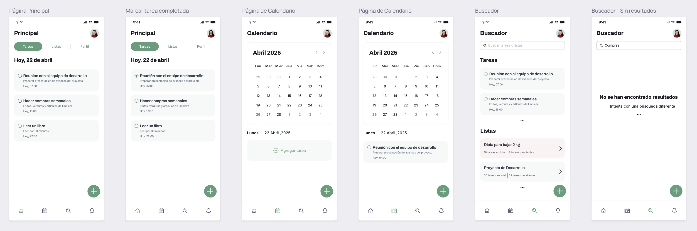

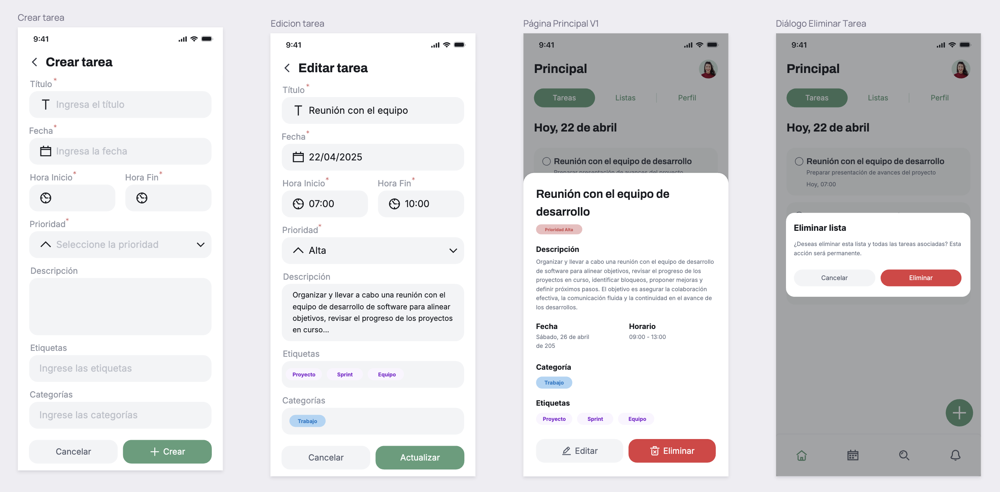

## Gestión de Listas

La gestión de listas permite organizar tareas en diferentes listas personalizadas. Los usuarios pueden crear, editar, eliminar listas, visualizar sus detalles, gestionar las tareas asignadas y aprovechar la generación automática de listas mediante Inteligencia Artificial.

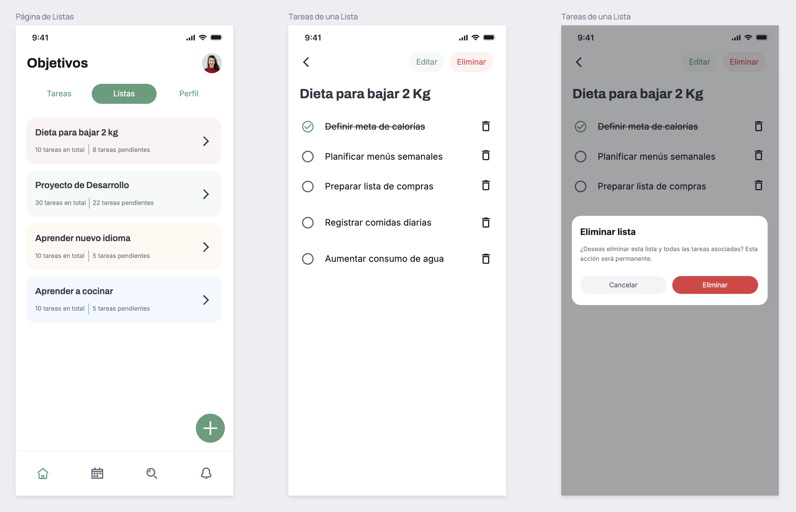

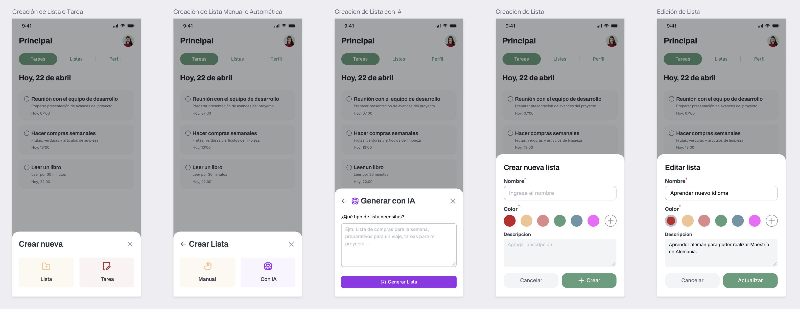

## Gestión de Notificaciones

La Gestión de notificaciones permite a los usuarios visualizar, configurar y recibir notificaciones relacionadas con sus tareas y listas. Esto ayuda a mantenerlos informados sobre eventos importantes y cambios dentro de la aplicación.

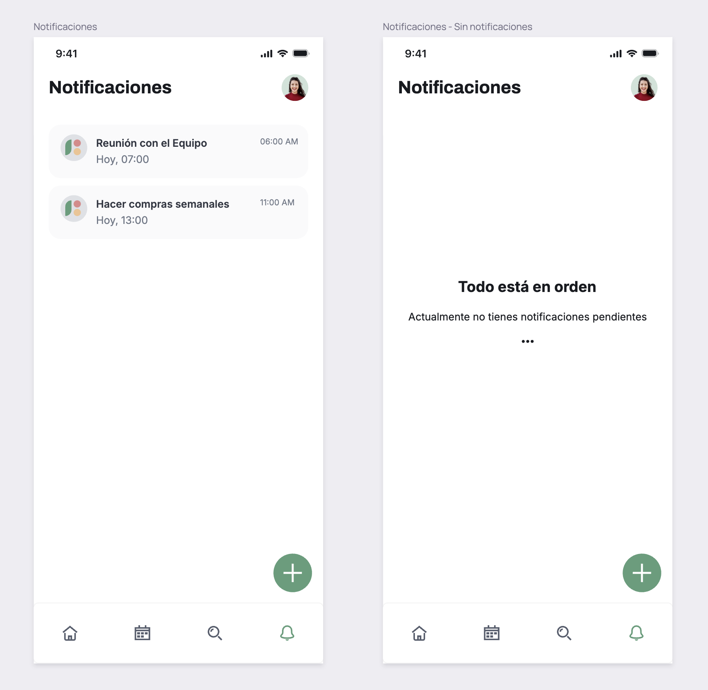

